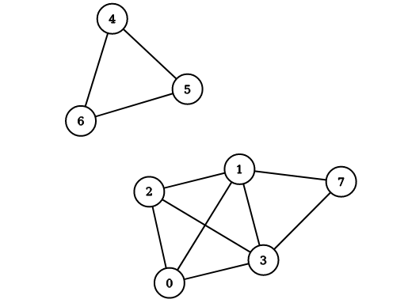

This is the first in this blog series <font color="green"><b>Explained: Graph Representation Learning</b></font> and to discuss extraction useful graph features and node embeddings by considering the topology of the network graph using machine learning, this blog deals with Deep Walk. This is a simple unsupervised online learning approach, very similar to language modeling used in <strong>NLP</strong>, where the goal is to generate word embeddings. In this case, generalizing the same concept, it merely tries to learn latent representations of nodes/vertices of a given graph. These graph embeddings, which capture neighborhood similarity and community membership, can then be used for learning downstream tasks on the graph. 


<center></center>
<br>

<h2><font color="red" >Motivation</font></h2>

Assume a setting, given a graph G where you wish to convert the nodes into embedding vectors, and the only information about a node are the indices of the nodes to which it is connected (adjacency matrix). Since there is no initial feature matrix corresponding to the data, we construct a feature matrix which will have all the randomly selected nodes. There can be multiple methods to select these, but here we are assuming that they are normally sampled (though it won't make much of a difference even if they are taken from some other distribution).


<h1><font color="black" >Random Walks </font></h1>
Random walk rooted at vertex $v_i$ as $W_{v_i}$. It is a stochastic process with random variables ${W^1}_{v_i}$, ${W^2}_{v_i}$, $. . .$, ${W^k}_{v_i}$ such that ${W^{k+1}}{v_i}$ is a vertex chosen at random from the
neighbors of vertex $v_k$. Random Walk distances are good features for many problems. We'll be discussing how these short random walks are analogous to the sentences in the language modeling setting and how we can carry the concept of context windows to graphs as well.

<hr/>
<!-- ## What is Power Law? -->
<h2>What is Power Law? </font></h2>
A scale-free network is a network whose degree distribution follows a power law, at least asymptotically. That is, the fraction $P(k)$ of nodes in the network having $k$ connections to other nodes goes for large values of $k$ as
$P(k) \sim k^{-\gamma}$ where $k=2,3$ etc.

<!-- -->
<center></center>

The network of global banking activity with nodes representing the absolute size of assets booked in the respective jurisdiction and the edges between them the exchange of financial assets, with data taken from the IMF, is a scale-free network and follows Power Law. We can then see clearly how very few core nodes dominate this network, there are approximately 200 countries in the world, but these 19 most significant jurisdictions in terms of capital together are responsible for over 90% of the assets.

<!--  -->
<center></center>

These highly centralized networks are more formally called scale-free or power-law networks, that describe a power or exponential relationship between the degree of connectivity a node has and the frequency of its occurrence. [More](https://www.youtube.com/watch?v=qmCrtuS9vtU) about centralized networks and power law.

<hr/>
<h2><center>Why is it important here? </center></h2>
Social networks, including collaboration networks, computer networks, financial networks, and Protein-protein interaction networks are some examples of networks claimed to be scale-free.

According to the authors,<strong> "If the degree distribution of a connected graph follows a power law (i.e. scale-free), we observe that the frequency which vertices appear in the short random walks will also follow a power-law distribution. Word frequency in natural language follows a similar distribution, and techniques from language modeling account for this distributional behavior."</strong>

<!--  -->
<center></center>
<center>$(a)$ comes from a series of short random walks on a scale-free graph, and $(b)$ comes from the text of 100,000 articles from the English Wikipedia.</center>

<hr/>

<h1><font ><center>Intuition with SkipGram </font></center></h1>
Think about the below unrelated problem for now:-

Given, some english sentences (could be any other language, doesn't matter) you need to find a vector corresponding to each word appearing at least once in the sentence such that the words having similar meaning appear close to each other in their vector space, and the opposite must hold for words which are dissimilar.

Suppose the sentences are
1. Hi, I am Bert.
2. Hello, this is Bert.

From the above sentences you can see that 1 and 2 are related to each other, so even if someone does'nt know the language, one can make out that the words 'Hi' and 'Hello' have roughly the same meaning. We will be using a technique similar to what a human uses while trying to find out related words. Yes! We'll be guessing the meaning based on the words which are common between the sentences. Mathematically, learning a representation in word-2-vec means learning a mapping function from the word co-occurences, and that is exactly what we are heading for.

<!-- #### But, How? -->
<h4><font color="black" >But, How? </font></h4>
First, let's get rid of the punctuations and assign a random vector to each word. Now since these vectors are assigned randomly, it implies the current representation is useless. We'll use our good old friend, *probability*, to convert these into meaningful representations. The aim is to increase the probability of a word occurring, considering the terms around it. Let's assume the probability is given by $P(x|y)$, where $y$ is the set of words that appear in the same sentence in which $x$ occurs. Remember we are only taking one sentence at a time, so first we'll maximize the probability of <font color="green">'Hi'</font> given <font color="green">{'I', 'am', 'Bert'} </font>, then we'll maximize the probability of <font color="green">'I'</font> given <font color="green">{'Hi', 'am', 'Bert'}</font>. We will do it for each word in the first sentence, and then for the second sentence. Repeat this procedure for all the sentences over and over again until the feature vectors have converged. 

One question that may arise now is, 'How do these feature vectors relate with the probability?'. The answer is that in the probability function, we'll utilize the word vectors assigned to them. But, aren't those vectors random? Ahh, they are at the start, but we promise you by the end of the blog they would have converged to the values, which gives some meaning to those seemingly random numbers.


<h3><font  >So, What exactly the probability function helps us with? </font></h3>
What does it mean to find the probability of a vector given other vectors? This is a simple question with a pretty simple answer, take it as a fill in the blank problem that you may have dealt with in the primary school,

<font color= "red">Roses ____ red.</font>

What is the most likely guess? Most people will fill it with an 'are'. (Unless you are pretending to be over smart in an attempt to prove how cool you are). You were able to fill that because you've seen some examples of the word 'are' previously in life, which help you with the context. The probability function is also trying to do the same; it is finding out the word which is most likely to occur given the words that are surrounding it.


<h4>But but this still doesn't explain how it's going to do that.</h4>
In case you guessed 'Neural Network', you are correct. In this blog we'll be using neural nets (feeling sleepy now, so let's wrap this up)

It is not necessary to use neural nets to estimate the probability function, but it works and looks cool :P, frankly, the authors used it, so we'll follow them.

The input layer will have |V| neurons, where |V| is the number of words that are interesting to us. We will be using only one hidden layer for simplicity. It can have as many neurons as you want, but it is suggested to keep a number that is less than the number of words in the vocabulary. The output layer will also have the |V| neurons.

Now let's move on to the interpretation of input and output layers (don't care about the hidden layer).
Lets suppose the words in the vocabulary are $V_1$, $V_2$, $...$ $V_i$, $....$ $V_n$. Assume that out of these V4, V7, V9 appears along with the word whose probability we are trying to maximize. So the input layers will have the 4th, 7th, and the 9th neuron with value 1, and all others will have the value 0. The hidden layer will then have some function of these values. The hidden layer has no non-linear activation. The |V| neuron in the output layer will have a score; the higher it is, the higher the chances of that word appearing along with the surrounding words. Apply <strong>Sigmoid, boom! we got the probabilities.</strong>

So a simple neural network will help us solve the fill in the blank problem.

<hr/>

<h3><font color="green">Deep Walk = SkipGram Analogy + Random Walks</font></h3>
These random walks can be thought of as short sentences and phrases in a special language; the direct analogy is to estimate the likelihood of observing vertex $v_i$ given all the previous vertices visited so far in the random walk, i.e., Our goal is to learn a latent representation, not only a probability distribution of node co-occurrences, and so we introduce a mapping function $ Φ: v ∈ V→R^{|V|×d} $. This mapping $Φ$ represents the latent social representation associated with each vertex $v$ in the graph. (In practice, we represent $Φ$ by a $|V|×d$ matrix of free parameters, which will serve later on as our $X_E$).

The problem then, is to estimate the likelihood: $ Pr ({v}_{i} | Φ(v1), Φ(v2), · · · , Φ(vi−1))) $

In simple words, *DeepWalk* algorithm uses the notion of Random Walks to get the surrounding nodes(words) and ultimately calculate the probability given the context nodes. In simple words we use random walk to start at a node, finds out all the nodes which have an edge connecting with this start node and randomly select one out of them, then consider this new node as the start node and repeat this procedure, after n iterations you will have traversed n nodes (some of them might repeat, but it does not matter as is the case of words in a sentence which may repeat as well). We will take n nodes as the surrounding nodes for the original node and will try to maximize probability concerning those using the probability function estimate. 

*So, that is for you Ladies and Gentlemen, the <b>'DeepWalk'</b> model.*

Mathematically the Deep Walk algorithm is defined as follows,

<!--  -->
<center></center>

<hr/>
<h2>PyTorch Implementation of DeepWalk </h2>

Here we will use using the following graph as an example to implement Deep Walk on,
<!--  -->
<center></center>

As you can see, there are two connected components so that we can expect than when we create the vectors for each node, the vectors of [1, 2, 3, 7] should be close and similarly that of [4, 5, 6] should be close. Also, if any two vectors are from different groups, then their vectors should also be far away.

Here we will represent the graph using the adjacency list representation. Make sure that you can understand that the given graph and this adjacency list are equivalent.


```python
adj_list = [[1,2,3], [0,2,3], [0, 1, 3], [0, 1, 2], [5, 6], [4,6], [4, 5], [1, 3]]
size_vertex = len(adj_list)  # number of vertices

## Imports

import torch
import torch.nn as nn
import random

## Hyperparameters
<h2>Hyperparameters</h2>

w=3            # window size
d=2            # embedding size
y=200          # walks per vertex
t=6            # walk length 
lr=0.025       # learning rate

v=[0,1,2,3,4,5,6,7] # labels of available vertices
```

<!-- ## Random Walk -->
<h2>Random Walk</h2>


```python
def RandomWalk(node,t):
    walk = [node]        # Walk starts from this node
    
    for i in range(t-1):
        node = adj_list[node][random.randint(0,len(adj_list[node])-1)]
        walk.append(node)

    return walk
```

<!-- ## Skipgram -->
<h2>Skipgram</h2>
The skipgram model is closely related to the <strong>CBOW</strong> model that we just covered. In the CBOW model, we have to maximize the probability of the word given its surrounding word using a neural network. And when the probability is maximized, the weights learned from the input to the hidden layer are the word vectors of the given words. In the skipgram word, we will be using a single word to maximize the probability of the surrounding words. This can be done by using a neural network that looks like the mirror image of the network that we used for the CBOW. And in the end, the weights of the input to the hidden layer will be the corresponding word vectors.

Now let's analyze the complexity. There are |V| words in the vocabulary, so for each iteration, we will be modifying a total of |V| vectors. This is very complex; usually, the vocabulary size is in millions, and since we usually need millions of iteration before convergence, this can take a long, long time to run.

We will soon be discussing some methods like Hierarchical Softmax or negative sampling to reduce this complexity. But, first, we'll code for a simple skipgram model. The class defines the model, whereas the function 'skip_gram' takes care of the training loop.


```python
class Model(torch.nn.Module):
    def __init__(self):
        super(Model, self).__init__()
        self.phi  = nn.Parameter(torch.rand((size_vertex, d), requires_grad=True))    
        self.phi2 = nn.Parameter(torch.rand((d, size_vertex), requires_grad=True))
        
        
    def forward(self, one_hot):
        hidden = torch.matmul(one_hot, self.phi)
        out    = torch.matmul(hidden, self.phi2)
        return out

model = Model()

def skip_gram(wvi,  w):
    for j in range(len(wvi)):
        for k in range(max(0,j-w) , min(j+w, len(wvi))):
            
            #generate one hot vector
            one_hot          = torch.zeros(size_vertex)
            one_hot[wvi[j]]  = 1
            
            out              = model(one_hot)
            loss             = torch.log(torch.sum(torch.exp(out))) - out[wvi[k]]
            loss.backward()
            
            for param in model.parameters():
                param.data.sub_(lr*param.grad)
                param.grad.data.zero_()
```


```python
for i in range(y):
    random.shuffle(v)
    for vi in v:
        wvi=RandomWalk(vi,t)
        skip_gram(wvi, w)
```

i'th row of the model.phi corresponds to the vector of the i'th node. As you can see, the vectors of [0, 1, 2, 3, 7] are very close, whereas their vectors are much different from the vectors corresponding to [4, 5, 6].


```python
print(model.phi)
```

    Parameter containing:
    tensor([[ 1.2371,  0.3519],
            [ 1.0416, -0.1595],
            [ 1.4024, -0.2323],
            [ 1.2611, -0.5249],
            [-1.1221,  0.8553],
            [-0.9691,  1.1747],
            [-1.3842,  0.4503],
            [ 0.2370, -1.2395]], requires_grad=True)


Now we will be discussing a variant of the above using Hierarchical softmax.

<!-- ## Hierarchical Softmax -->
<h1><center>Hierarchical Softmax<center></h1>

As we have seen in the skipgram model that the probability of any outcome depends on the total outcomes of our model. If you haven't noticed this yet, let us explain to you how!

When we calculate the probability of an outcome using softmax, this probability depends on the number of model parameters via the normalization constant(denominator term) in the softmax.

$\text{Softmax}(x_{i}) = \frac{\exp(x_i)}{\sum_j \exp(x_j)}$

And the number of such parameters is linear in the total number of outcomes. It means that if we are dealing with a huge graphical structure, it can be computationally costly and taking much time.

<!-- ### Can we somehow overcome this challenge? -->
<h3>Can we somehow overcome this challenge?</h3>
Obviously, Yes! (because we're asking at this stage). 

\*Drum roll please\*

<b>Enter "Hierarchical Softmax(HS)"</b>.

HS is an alternative approximation to the softmax in which the probability of any one outcome depends on several model parameters that is only logarithmic in the total number of outcomes.

Hierarchical softmax uses a binary tree to represent all the words(nodes) in the vocabulary. Each leaf of the tree is a node of our graph, and there is a unique path from the root to the leaf. Each intermediate node of the tree explicitly represents the relative probabilities of its child nodes. So these nodes are associated to different vectors which our model is going to learn.

The idea behind decomposing the output layer into a binary tree is to reduce the time complexity to obtain 
probability distribution from $O(V)$ to $O(log(V))$

Let us understand the process with an example.

<!--  -->
<center></center>
In this example, leaf nodes represent the original nodes of our graph. The highlighted nodes and edges make a path from root to an example leaf node $w_2$.

Here, length of the path $L(w_{2}) = 4$.

$n(w, j)$ means the $j^{th}$ node on the path from root to a leaf node $w$.

Now, view this tree as a decision process or a random walk that begins at the root of the tree and descents towards the leaf nodes at each step. It turns out that the probability of each outcome in the original distribution uniquely determines the transition probabilities of this random walk. If you want to go from root node to $w_2$(say), first, you have to take a left turn, again left turn and then right turn. 

Let's denote the probability of going left at an intermediate node $n$ as $p(n,left)$ and probability of going right as $p(n,right)$. So we can define the probability of going to $w_2$ as follows.

<b> $P(w2|wi) = p(n(w_{2}, 1), left) . p(n(w_{2}, 2),left) . p(n(w_{2}, 3), right)$ </b>

The above process implies that the cost for computing the loss function and its gradient will be proportional to the number of nodes $(V)$ in the intermediate path between the root node and the output node, which on average, is no higher than $log(V)$. That's nice! Isn't it? In the case where we deal with a large number of outcomes, there will be a massive difference in the computational cost of 'vanilla' softmax and hierarchical softmax.

Implementation remains similar to the vanilla, except that we will only need to change the Model class by HierarchicalModel class, which is defined below.


```python
def func_L(w):
    """
    Parameters
    ----------
    w: Leaf node.
    
    Returns
    -------
    count: The length of path from the root node to the given vertex.
    """
    count=1
    while(w!=1):
        count+=1
        w//=2

    return count
```


```python
# func_n returns the nth node in the path from the root node to the given vertex
def func_n(w, j):
    li=[w]
    while(w!=1):
        w = w//2
        li.append(w)

    li.reverse()
    
    return li[j]
```


```python
def sigmoid(x):
    out = 1/(1+torch.exp(-x))
    return out
```


```python
class HierarchicalModel(torch.nn.Module):
    
    def __init__(self):
        super(HierarchicalModel, self).__init__()
        self.phi         = nn.Parameter(torch.rand((size_vertex, d), requires_grad=True))   
        self.prob_tensor = nn.Parameter(torch.rand((2*size_vertex, d), requires_grad=True))
    
    def forward(self, wi, wo):
        one_hot     = torch.zeros(size_vertex)
        one_hot[wi] = 1
        w = size_vertex + wo
        h = torch.matmul(one_hot,self.phi)
        p = torch.tensor([1.0])
        for j in range(1, func_L(w)-1):
            mult = -1
            if(func_n(w, j+1)==2*func_n(w, j)): # Left child
                mult = 1
        
            p = p*sigmoid(mult*torch.matmul(self.prob_tensor[func_n(w,j)], h))
        
        return p
```

The input to hidden weight vector no longer represents the vector corresponding to each vector, so directly trying to read it will not provide any valuable insight, a better option is to predict the probability of different vectors against each other to figure out the likelihood of coexistence of the nodes.


```python
hierarchicalModel = HierarchicalModel()

def HierarchicalSkipGram(wvi,  w):
   
    for j in range(len(wvi)):
        for k in range(max(0,j-w) , min(j+w, len(wvi))):
            #generate one hot vector
       
            prob = hierarchicalModel(wvi[j], wvi[k])
            loss = - torch.log(prob)
            loss.backward()
            for param in hierarchicalModel.parameters():
                param.data.sub_(lr*param.grad)
                param.grad.data.zero_()

for i in range(y):
    random.shuffle(v)
    for vi in v:
        wvi = RandomWalk(vi,t)
        HierarchicalSkipGram(wvi, w)

for i in range(8):
    for j in range(8):
        print((hierarchicalModel(i,j).item()*100)//1, end=' ')
    print(end = '\n')
```

    24.0 28.0 23.0 22.0 14.0 8.0 5.0 70.0 
    24.0 31.0 23.0 21.0 8.0 3.0 1.0 86.0 
    22.0 25.0 25.0 26.0 15.0 11.0 2.0 69.0 
    19.0 23.0 26.0 31.0 10.0 7.0 0.0 81.0 
    36.0 33.0 18.0 12.0 39.0 29.0 31.0 0.0 
    31.0 28.0 22.0 18.0 34.0 34.0 30.0 0.0 
    33.0 30.0 20.0 15.0 35.0 28.0 35.0 0.0 
    20.0 26.0 25.0 27.0 6.0 3.0 0.0 90.0 

<hr/>

You can find our implementation made using PyTorch in the following notebook <b><font color="red">[Deep Walk](https://github.com/dsgiitr/graph_nets/blob/master/DeepWalk/DeepWalk_Blog+Code.ipynb)</font></b>. [graph_nets](https://github.com/dsgiitr/graph_nets)

<h3>References</h3>

- [Code & GitHub Repository](https://github.com/dsgiitr/graph_nets)

- [DeepWalk: Online Learning of Social Representations](http://www.perozzi.net/publications/14_kdd_deepwalk.pdf)

- [An Illustrated Explanation of Using SkipGram To Encode The Structure of A Graph (DeepWalk)](https://medium.com/@_init_/an-illustrated-explanation-of-using-skipgram-to-encode-the-structure-of-a-graph-deepwalk-6220e304d71b?source=---------13------------------)

- [Word Embedding](https://medium.com/data-science-group-iitr/word-embedding-2d05d270b285)

- [Centralized & Scale Free Networks](https://www.youtube.com/watch?v=qmCrtuS9vtU)


- Beautiful explanations by Chris McCormick:
    - [Hieararchical Softmax](https://youtu.be/pzyIWCelt_E)
    - [word2vec](http://mccormickml.com/2019/03/12/the-inner-workings-of-word2vec/)
    - [Negative Sampling](http://mccormickml.com/2017/01/11/word2vec-tutorial-part-2-negative-sampling/)
    - [skip-gram](http://mccormickml.com/2016/04/19/word2vec-tutorial-the-skip-gram-model/)
    
<hr/>
<h3>Written By</h3>

- Ajit Pant
- Shubham Chandel
- Anirudh Dagar
- Shashank Gupta
